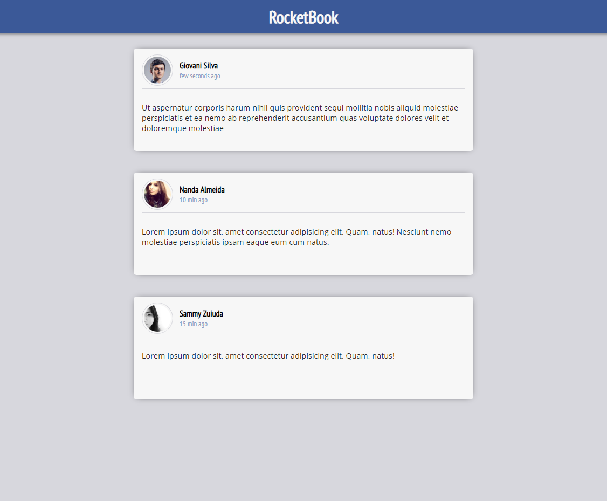

# RocketBook

## Simples posts timeline feito ReactJS.

Estrutura ReactJS do zero com Babel, Webpack e Webpack Dev Server. Além
disso, utilize as ferramentas ESLint, EditorConfig e Prettier

## Regras

- O Header deve ser um componente separado;
- O Post deve ser um componente separado;
- O header do post aonde estão o avatar, nome e tempo do post devem estar em um componente separado chamado PostHeader;
- Os posts devem estar armazenado no estado (state) do arquivo principal;
- Passar a informação dos posts como uma única propriedade para o
  componente de Post quando realizar o map no state de posts: ;

  > “O extraordinário começa onde termina sua zona de conforto”!
